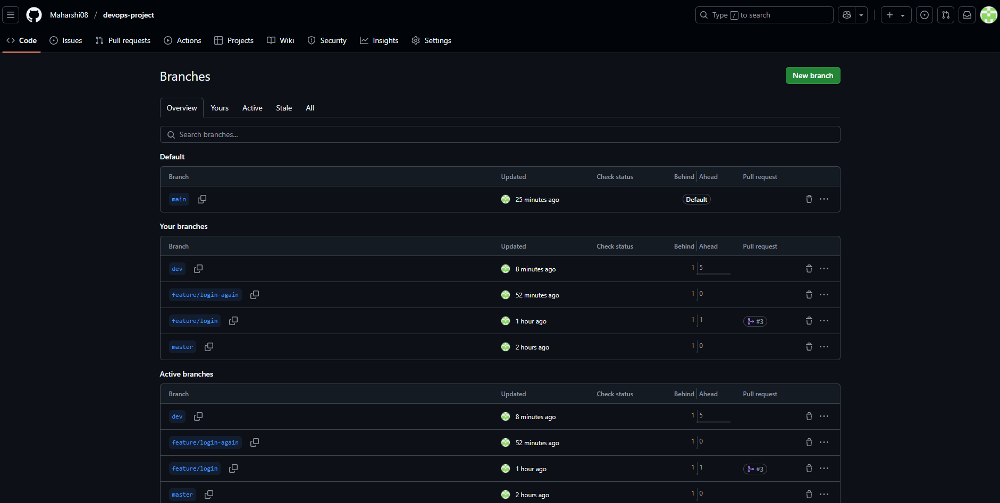

# DevOps Project

This is a sample DevOps project to demonstrate version control, collaboration, and Git best practices.

## 🚀 Project Structure

- `main` – production-ready code
- `dev` – development integration
- `feature/*` – individual features under development

## 🛠 Tools Used

- Git & GitHub
- Markdown
- Branching & Pull Requests

## ✅ How to Contribute

1. Fork the repo
2. Clone your forked repo
3. Create a feature branch (`feature/your-feature`)
4. Make changes and commit
5. Push and create a Pull Request to the `dev` branch

## 📂 Folder Structure
devops-project/ ├── README.md ├── .gitignore ├── DEV.md └── any other project files

## Task: Add Login Feature

This task involved creating a feature branch, adding a login script, and creating a pull request to merge it into the dev branch.

### Screenshots

#### ✅ Created Pull Request

#### ✅ Merged Pull Request

#### ✅ Dev Branch Commits

